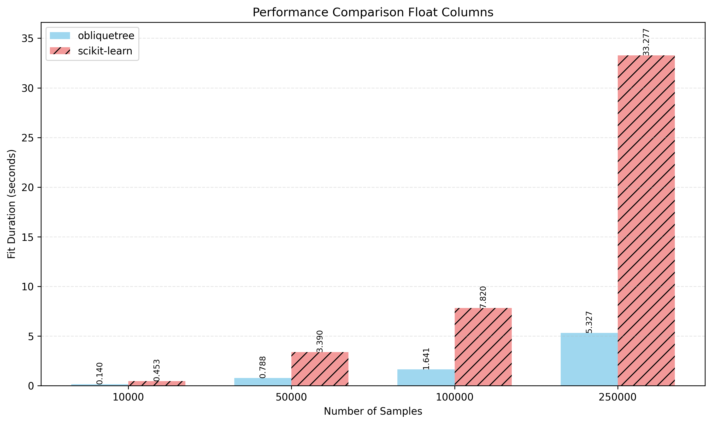
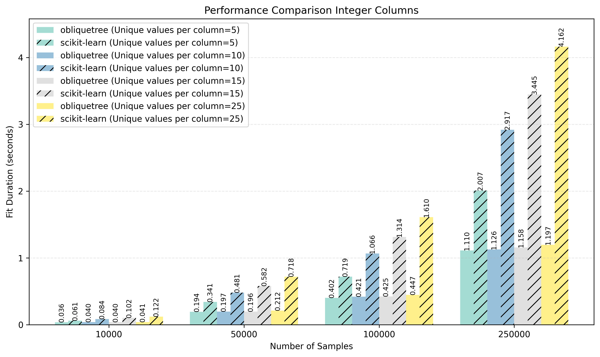

# obliquetree

`obliquetree` is an advanced decision tree implementation designed to provide high-performance and interpretable models. It supports both classification and regression tasks, enabling a wide range of applications. By offering traditional and oblique splits, it ensures flexibility and improved generalization with shallow trees. This makes it a powerful alternative to regular decision trees.


----

## Getting Started

`obliquetree` combines advanced capabilities with efficient performance. It supports **oblique splits**, leveraging **L-BFGS optimization** to determine the best linear weights for splits, ensuring both speed and accuracy.

In **traditional mode**, without oblique splits, `obliquetree` outperforms `scikit-learn` in terms of speed and adds support for **categorical variables**, providing a significant advantage over many traditional decision tree implementations.

When the **oblique feature** is enabled, `obliquetree` dynamically selects the optimal split type between oblique and traditional splits. If no weights can be found to reduce impurity, it defaults to an **axis-aligned split**, ensuring robustness and adaptability in various scenarios.

In very large trees (e.g., depth 10 or more), the performance of `obliquetree` may converge closely with **traditional trees**. The true strength of `obliquetree` lies in their ability to perform exceptionally well at **shallower depths**, offering improved generalization with fewer splits. Moreover, thanks to linear projections, `obliquetree` significantly outperform traditional trees when working with datasets that exhibit **linear relationships**.

-----
## Installation
To install `obliquetree`, use the following pip command:
```bash
pip install obliquetree
```

Using the `obliquetree` library is simple and intuitive. Here's a more generic example that works for both classification and regression:


```python
from obliquetree import Classifier, Regressor

# Initialize the model (Classifier or Regressor)
model = Classifier(  # Replace "Classifier" with "Regressor" if performing regression
    use_oblique=True,       # Enable oblique splits
    max_depth=2,            # Set the maximum depth of the tree
    n_pair=2,               # Number of feature pairs for optimization
    random_state=42,        # Set a random state for reproducibility
    categories=[0, 10, 32], # Specify which features are categorical
)

# Train the model on the training dataset
model.fit(X_train, y_train)

# Predict on the test dataset
y_pred = model.predict(X_test)
```
-----

## Documentation
For example usage, API details, comparisons with axis-aligned trees, and in-depth insights into the algorithmic foundation, we **strongly recommend** referring to the full [documentation](https://obliquetree.readthedocs.io/en/latest/).

---
## Key Features

- **Oblique Splits**  
  Perform oblique splits using linear combinations of features to capture complex patterns in data. Supports both linear and soft decision tree objectives for flexible and accurate modeling.

- **Axis-Aligned Splits**  
  Offers conventional (axis-aligned) splits, enabling users to leverage standard decision tree behavior for simplicity and interpretability.

- **Feature Constraints**  
  Limit the number of features used in oblique splits with the `n_pair` parameter, promoting simpler, more interpretable tree structures while retaining predictive power.

- **Seamless Categorical Feature Handling**  
  Natively supports categorical columns with minimal preprocessing. Only label encoding is required, removing the need for extensive data transformation.

- **Robust Handling of Missing Values**  
  Automatically assigns `NaN` values to the optimal leaf for axis-aligned splits.

- **Customizable Tree Structures**  
  The flexible API empowers users to design their own tree architectures easily.

- **Exact Equivalence with `scikit-learn`**  
  Guarantees results identical to `scikit-learn`'s decision trees when oblique and categorical splitting are disabled.

- **Parallel Split Search**
  Utilizes OpenMP-based parallelism during tree construction to evaluate splits in parallel across features, enabling significant speedups on multi-core systems.

- **Optimized Performance**
  Outperforms `scikit-learn` in terms of speed and efficiency when oblique and categorical splitting are disabled:
  - Up to **600% faster** for datasets with float columns.
  - Up to **400% faster** for datasets with integer columns.

  

  


----
### Contributing
Contributions are welcome! If you'd like to improve `obliquetree` or suggest new features, feel free to fork the repository and submit a pull request.

-----
### License
`obliquetree` is released under the MIT License. See the LICENSE file for more details.